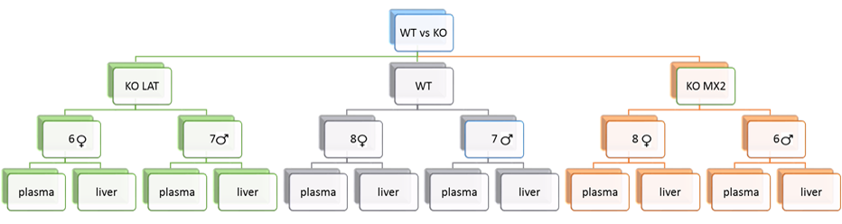
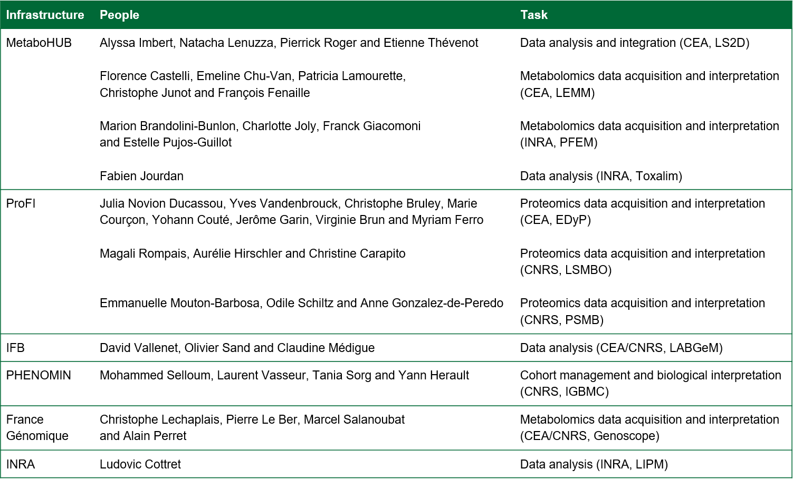

# The **ProMetIS** R package: Multi-omics phenotyping of the LAT and MX2 knockout mice

## Description

This package provides the data sets and analyzes from the preclinical, proteomics, and metabolomics study of the LAT and MX2 knockout mice.

## Installation

The package can be installed from github with `devtools::install_github("IFB-ElixirFr/ProMetIS")`.

## Authors

Alyssa Imbert, Florence Castelli, Magali Rompais, Mohammed Selloum, Emmanuelle Mouton-Barbosa, Thomas Burger, Marion Brandolini-Bunlon, Arthur Tenenhaus, Yves Vandenbrouck, Olivier Sand, Pierrick Roger, Natacha Lenuzza, Emeline Chu-Van, Charlotte Joly, Julia Novion Ducassou, Tania Sorg, Bernard Malissen, Christophe Bruley, Laurent Vasseur, Aurélie Hirschler, Yohann Couté, David Bouyssié, Marie Courçon, Odile Schiltz, Virginie Brun, Jérôme Garin, Claudine Médigue, Christophe Junot, David Vallenet, Anne Gonzalez-de-Peredo, Myriam Ferro, Estelle Pujos-Guillot, Yann Herault, Christine Carapito, François Fenaille and Etienne A. Thévenot (ProMetIS consortium)

## Maintainers

Alyssa Imbert and Etienne A. Thévenot

## Experimental design

## Consortium

## Funding

The ProMetIS project is funded by five French National Infrastructures:

* [PHENOMIN: Mouse Phenogenomics](http://www.phenomin.fr/en-us/) [ANR-10-INBS-0007]

* [France Genomique](https://www.france-genomique.org/?lang=en) [ANR-10-INBS-0009]

* [ProFI: Proteomics](http://www.profiproteomics.fr/) [ANR-10-INBS-0008]

* [MetaboHUB: Metabolomics and Fluxomics](https://www.metabohub.fr/home.html) [ANR-11-INBS-0010]

* [IFB: Bioinformatics](https://www.france-bioinformatique.fr/en) [ANR-11-INBS-0013]

In particular, Alyssa Imbert is supported by a post-doctoral fellowship from IFB as part of the [pilot projects in integrative bioinformatics](https://www.france-bioinformatique.fr/en/pilot-projects).

## Citation

Please cite:

**The ProMetIS resource for proteomics and metabolomics data analysis and integration (2020). Alyssa Imbert, Florence Castelli, Magali Rompais, Mohammed Selloum, Emmanuelle Mouton-Barbosa, Thomas Burger, Marion Brandolini-Bunlon, Arthur Tenenhaus, Yves Vandenbrouck, Olivier Sand, Pierrick Roger, Natacha Lenuzza, Emeline Chu-Van, Charlotte Joly, Julia Novion Ducassou, Tania Sorg, Bernard Malissen, Christophe Bruley, Laurent Vasseur, Aurélie Hirschler, Yohann Couté, David Bouyssié, Marie Courçon, Odile Schiltz, Virginie Brun, Jérôme Garin, Claudine Médigue, Christophe Junot, David Vallenet, Anne Gonzalez-de-Peredo, Myriam Ferro, Estelle Pujos-Guillot, Yann Herault, Christine Carapito, François Fenaille and Etienne A. Thévenot (ProMetIS consortium). https://github.com/IFB-ElixirFr/ProMetIS.**