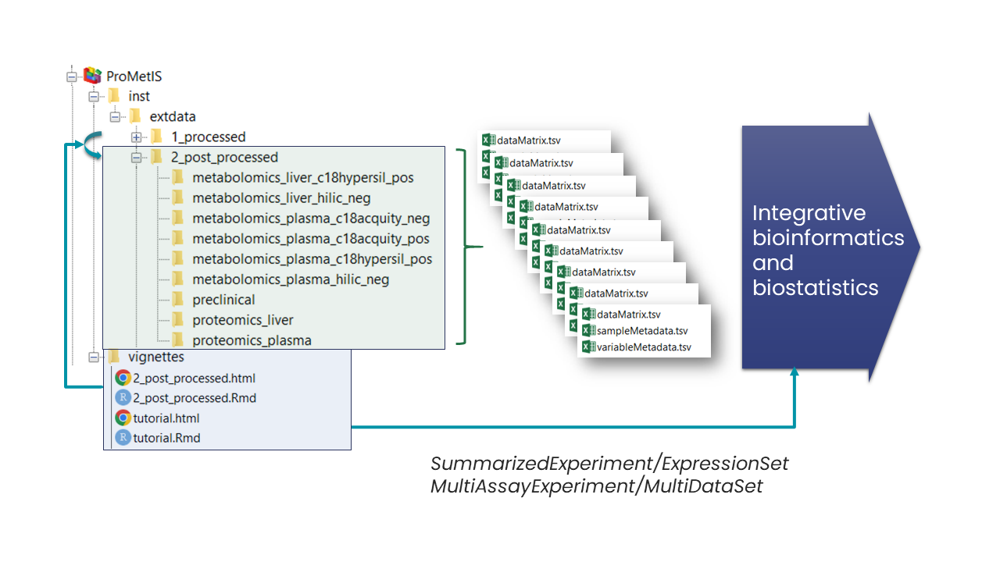

# The _**ProMetIS**_ R package: Multi-omics phenotyping of the LAT and MX2 knockout mice

## Description

This package provides the data sets and analyzes from the preclinical, proteomics, and metabolomics study of the LAT and MX2 knockout mice.

## Installation

The package can be installed from GitHub with `devtools::install_github("IFB-ElixirFr/ProMetIS")`.

## Maintainer

Etienne A. Thévenot (etienne.thevenot@cea.fr)

## Experimental design

A total of 42 mice from the *Lat-/-* and *Mx2-/-* genotypes (as well as the wild-type controls), and from both sex, were analyzed by a series of phenomic (preclinical) measurements. Liver and plasma samples from all mice were further analyzed at the molecular level by proteomics and metabolomics.

## Datasets

The number of features after the post-processing step is shown for each of the 9 datasets (1 preclinical, 2 proteomics, 6 metabolomics). The number of annotated metabolites is indicated in squared brackets. The names of the metabolomics datasets include the reference to the chromatographic column (c18hypersil: Hypersil GOLD C18, hilic: ZIC-pHILIC, and c18acquity: Acquity HSS-T3) and the ionization mode (pos: positive, and neg: negative).

## Package structure: data and vignettes

The data are available in the extdata folder, which is organized into subfolders corresponding to the successive steps of the analysis (e.g, *1_processed*, *2_post_processed*, *5_aggregated*, etc.). Within each subfolder, the 9 datasets are stored as a triplet of tabular files containing the matrix of intensities (*dataMatrix.tsv*), the sample metadata (*sampleMetadata.tsv*) and the variable metadata (*variableMetadata.tsv*). For each step, a vignette describes the methods used to process the data. As an example, the *2_post_processed* vignette details how the datasets were post-processed, between the *1_processed* and the *2_post_processed* folders. The *tutorial* vignette describes how to access the final aggregated data to perform integrative bioinformatic and biostatistic analyses.

## Funding

The ProMetIS project is funded by five French National Infrastructures:

* [PHENOMIN: Mouse Phenogenomics](http://www.phenomin.fr/en-us/) [ANR-10-INBS-0007]

* [France Genomique](https://www.france-genomique.org/?lang=en) [ANR-10-INBS-0009]

* [ProFI: Proteomics](http://www.profiproteomics.fr/) [ANR-10-INBS-0008]

* [MetaboHUB: Metabolomics and Fluxomics](https://www.metabohub.fr/home.html) [ANR-11-INBS-0010]

* [IFB: Bioinformatics](https://www.france-bioinformatique.fr/en) [ANR-11-INBS-0013]

In particular, Alyssa Imbert is supported by a post-doctoral fellowship from IFB as part of the [pilot projects in integrative bioinformatics](https://www.france-bioinformatique.fr/en/pilot-projects).

## License

[CeCILL 2.1 free software license](https://cecill.info/licences/Licence_CeCILL_V2.1-en.html)

## Citation

**ProMetIS: deep phenotyping of mouse models by combined proteomics and metabolomics analysis.** Alyssa Imbert, Magali Rompais, Mohammed Selloum, Florence Castelli, Emmanuelle Mouton-Barbosa, Marion Brandolini-Bunlon, Emeline Chu-Van, Charlotte Joly, Aurélie Hirschler, Pierrick Roger, Thomas Burger, Sophie Leblanc, Tania Sorg, Sadia Ouzia, Yves Vandenbrouck, Claudine Médigue, Christophe Junot, Myriam Ferro, Estelle Pujos-Guillot, Anne Gonzalez de Peredo, François Fenaille, Christine Carapito, Yann Herault, and Etienne A. Thévenot (ProMetIS consortium), *submitted*, [https://github.com/IFB-ElixirFr/ProMetIS](https://github.com/IFB-ElixirFr/ProMetIS).